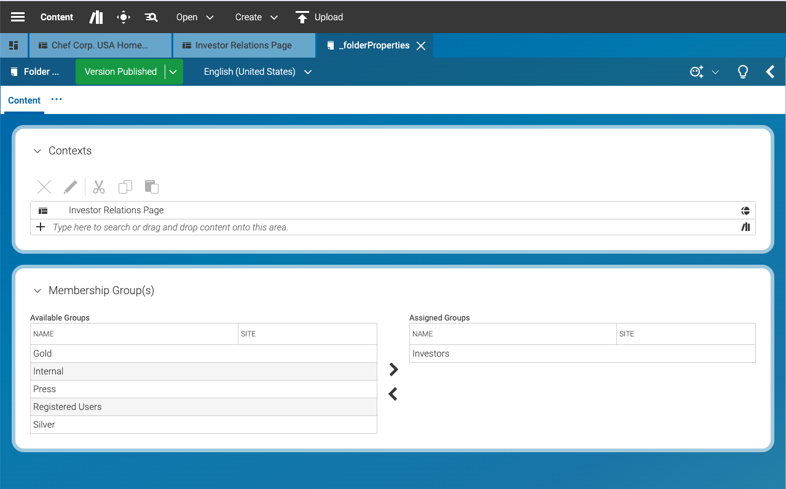
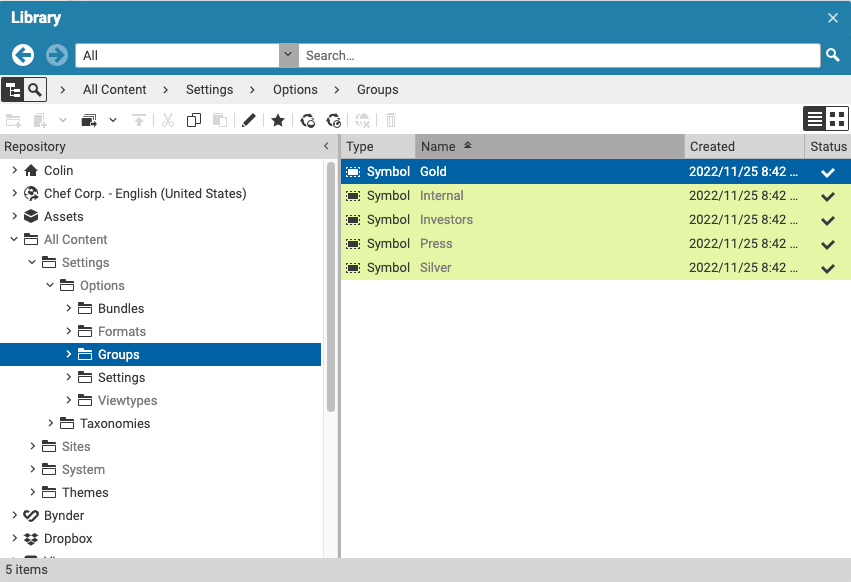

# CoreMedia 'Closed User Groups'
The Closed User Group (CUG) project is a CoreMedia Blueprint extension with the goal to provide restricted content areas
on the CoreMedia CAE delivery. Editors  use CoreMedia Studio to define content visibility restrictions based on 
customer roles. The CoreMedia CAE and Search restrict accessability of content items according to the setup in Studio.

This extension implements a folder based restriction model based on a positive list. Visibility settings are stored in the
folderProperties content type. The CAE uses Spring Security to authenticate and authorize users. As an example implementation 
this extension provides a Spring Security Filter for the persona chooser provided with CoreMedia Adaptive Personalization.
See also: 
```
closedusergroup-preview-cae/src/main/java/com/coremedia/blueprint/cug/cae/preview/TestUserProfileAutoLoginFilter.java
```
 
### Setup of user roles and define visibility restrictions
The implementation uses the Spring Security Contexts to provide users identity and authorities. Authorities are managed via CMSymbol 
content items linked to the folderProperties content item of the folder you want to restrict the visibility for.





### Installation

- From the project's root folder, clone this repository as submodule into the extensions folder. Make sure to use the branch name that matches your workspace version. 
```
git submodule add  -b main https://github.com/coremedia-contributions/closedusergroups modules/extensions/closedusergroups
```

- Use the extension tool in the root folder of the project to link the modules into your workspace.
 ```
mvn -f workspace-configuration/extensions extensions:sync -Denable=closedusergroups
```


