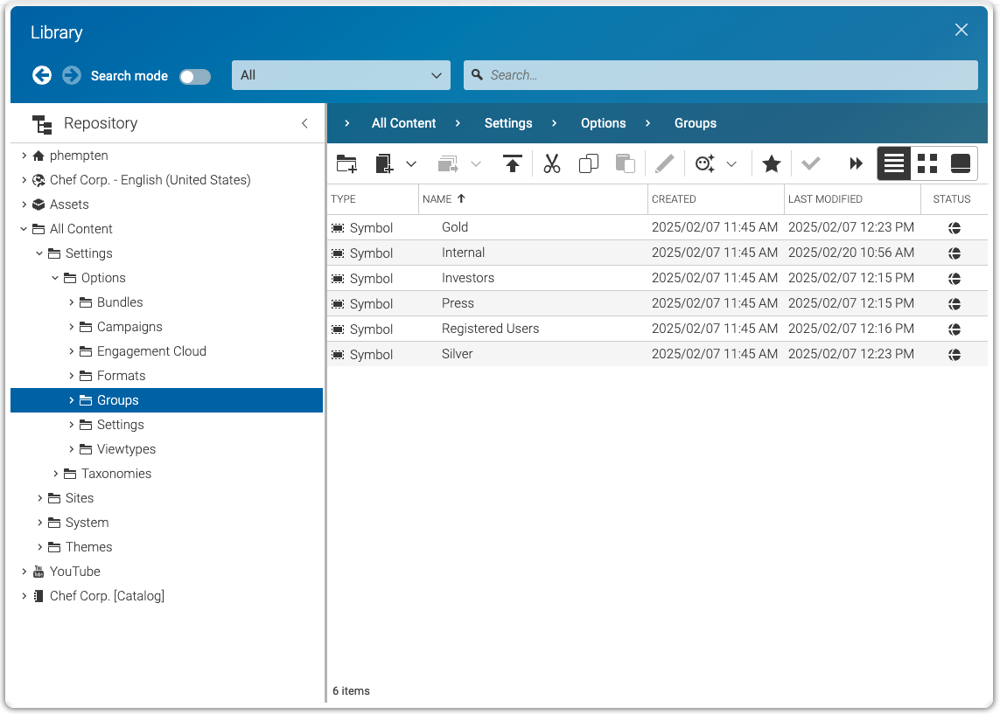

 this project is compatible with.
Please read the versioning section of the project to see what other CoreMedia versions are supported and how to find them."
)


# CoreMedia 'Closed User Groups'
The Closed User Group (CUG) project is a CoreMedia Blueprint extension with the goal to provide restricted content areas
on the CoreMedia CAE delivery. Editors  use CoreMedia Studio to define content visibility restrictions based on 
customer roles. The CoreMedia CAE and Search restrict accessibility of content items according to the setup in Studio.

This extension implements a folder based restriction model based on a positive list. Visibility settings are stored in the
folderProperties content type. The CAE and Headless-Server uses Spring Security to authenticate and authorize users. As an example implementation 
this extension provides a Spring Security Filter for the persona chooser provided with CoreMedia Personalization.
See also: 
```
closedusergroup-preview-cae/src/main/java/com/coremedia/blueprint/cug/cae/preview/TestUserProfileAutoLoginFilter.java
closedusergroup-headless-server/src/main/java/com/coremedia/blueprint/cug/filter/AuthoritiesTestContextExtractor.java
```
 
### Setup of user roles and define visibility restrictions
The implementation uses the Spring Security Contexts to provide users identity and authorities. Authorities are managed via CMSymbol 
content items linked to the folderProperties content item of the folder you want to restrict the visibility for.




### Installation

- From the project's root folder, clone this repository as submodule into the extensions folder. Make sure to use the branch name that matches your workspace version. 
```
git submodule add  -b main https://github.com/coremedia-contributions/closedusergroups modules/extensions/closedusergroups
```

- Use the extension tool in the root folder of the project to link the modules into your workspace.
 ```
mvn -f workspace-configuration/extensions extensions:sync -Denable=closedusergroups
```

## CoreMedia Community
This is a CoreMedia Community project!

Each CoreMedia Community project is an extra feature to be used with CoreMedia Content Cloud, including plugins, extensions, tools and 
3rd party integrations.

This code is meant to be example code, illustrating a set of features that could be used to enhance your 
CoreMedia experience. We'd love to hear your feedback on use-cases and further developments! 

The code comes as open-source without any warranties and is maintained on a best effort.


